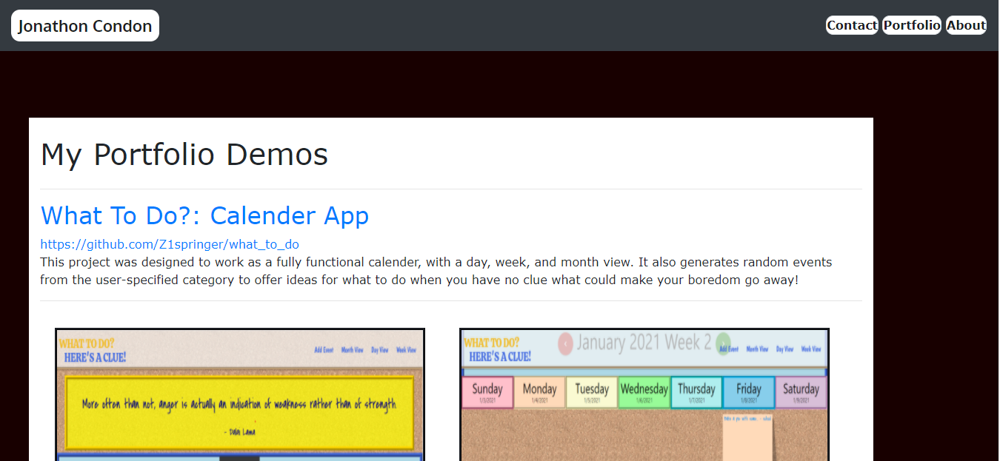
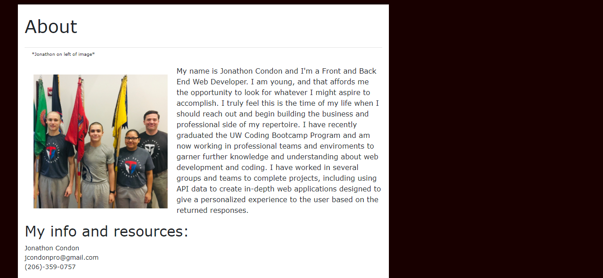
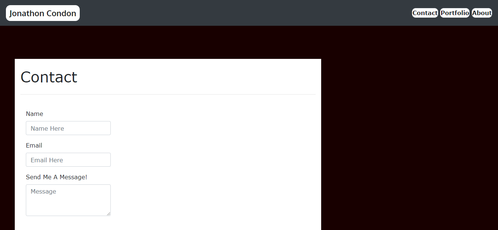

# Portfolio

Link to deployed site: [https://jcdon.github.io/PortfolioJCC/](https://jcdon.github.io/PortfolioJCC/)

## Description

This site was created using bootstrap and html to create a site for displaying my personal portfolio. Three pages display my Main Info, Contact Info, and About Me Info. All links are active and working and lead to polished profiles and resume.

This main page contains all of the projects that I am displaying and provides links and images for anyone wishing to view my work.

This about page tells all about who I am and contains an image of myself at the Washington Youth Academy. At the bottom of the page are my contact info and links to my github, linkedIn, and resume.

This contact page is the source for anyone viewing my portfolio to leave their contact info for me to review and reach out to them when ever they submit a contact request.

## License

MIT License

Copyright (c) [year] [fullname]

Permission is hereby granted, free of charge, to any person obtaining a copy
of this software and associated documentation files (the "Software"), to deal
in the Software without restriction, including without limitation the rights
to use, copy, modify, merge, publish, distribute, sublicense, and/or sell
copies of the Software, and to permit persons to whom the Software is
furnished to do so, subject to the following conditions:

The above copyright notice and this permission notice shall be included in all
copies or substantial portions of the Software.

THE SOFTWARE IS PROVIDED "AS IS", WITHOUT WARRANTY OF ANY KIND, EXPRESS OR
IMPLIED, INCLUDING BUT NOT LIMITED TO THE WARRANTIES OF MERCHANTABILITY,
FITNESS FOR A PARTICULAR PURPOSE AND NONINFRINGEMENT. IN NO EVENT SHALL THE
AUTHORS OR COPYRIGHT HOLDERS BE LIABLE FOR ANY CLAIM, DAMAGES OR OTHER
LIABILITY, WHETHER IN AN ACTION OF CONTRACT, TORT OR OTHERWISE, ARISING FROM,
OUT OF OR IN CONNECTION WITH THE SOFTWARE OR THE USE OR OTHER DEALINGS IN THE
SOFTWARE.

## Contact

Contact me, Jonathon Condon, at jcondonpro@gmail.com with any questions you may have.